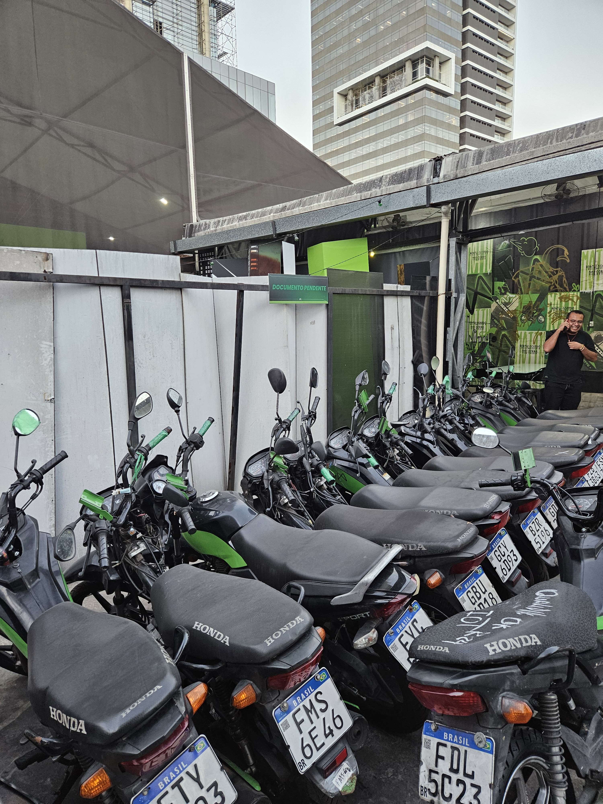
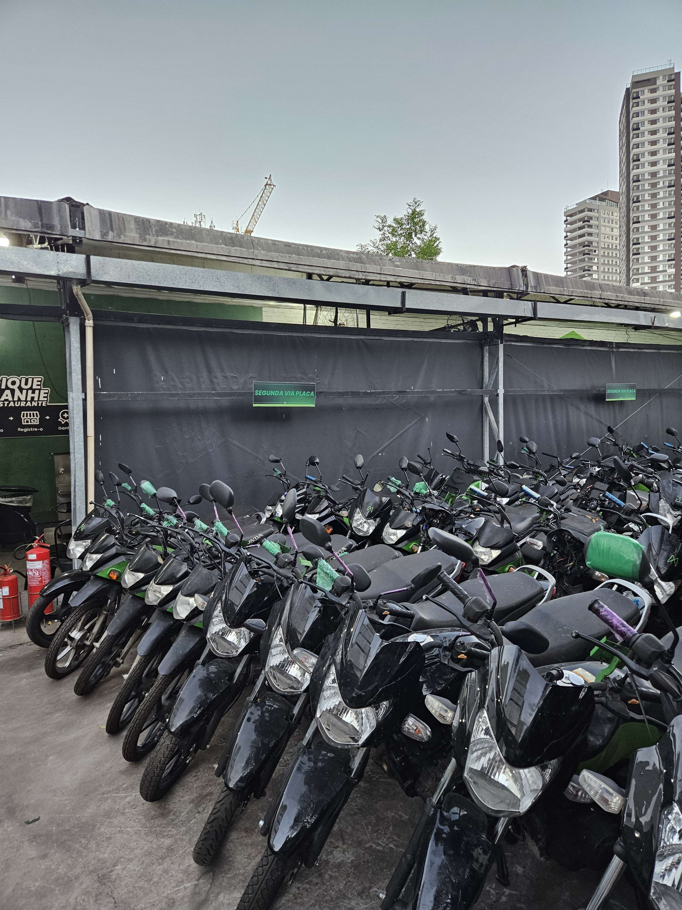
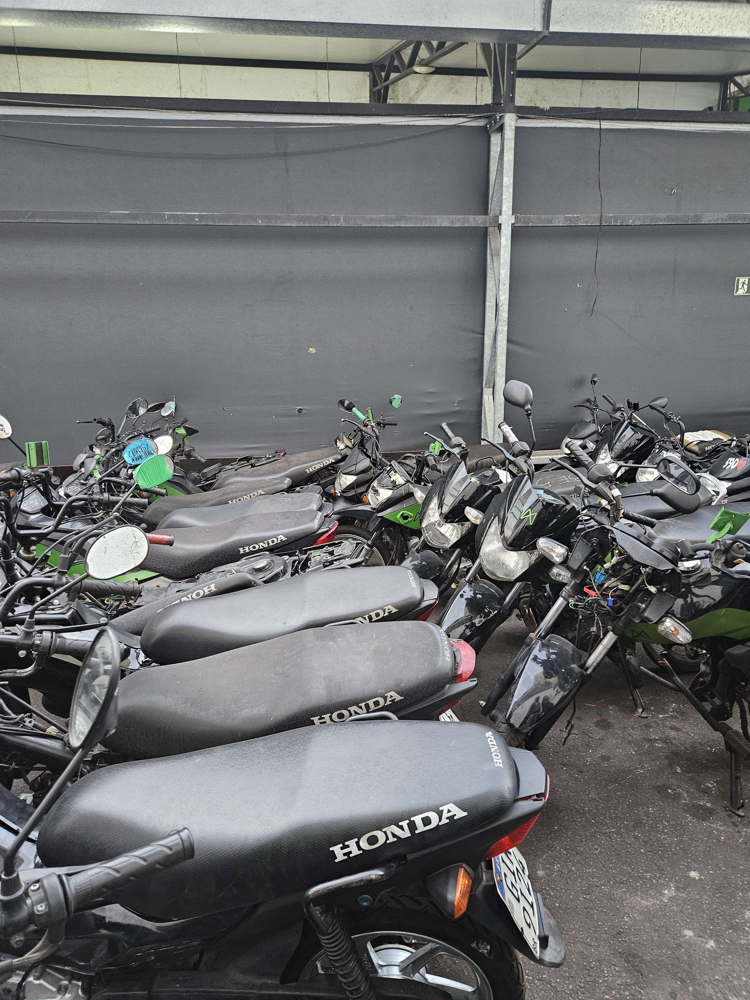
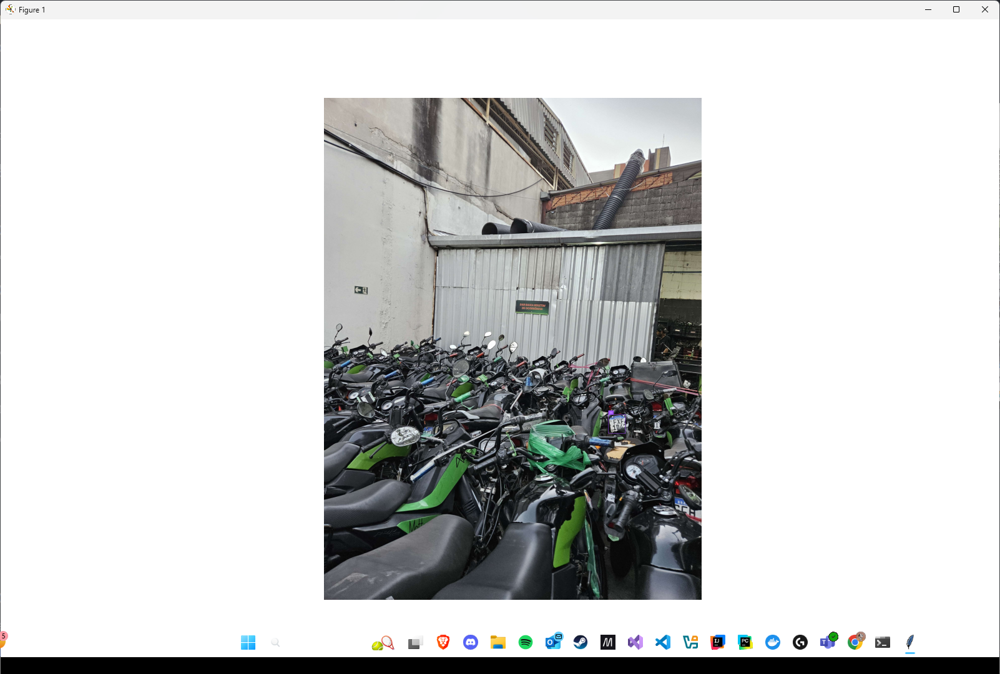
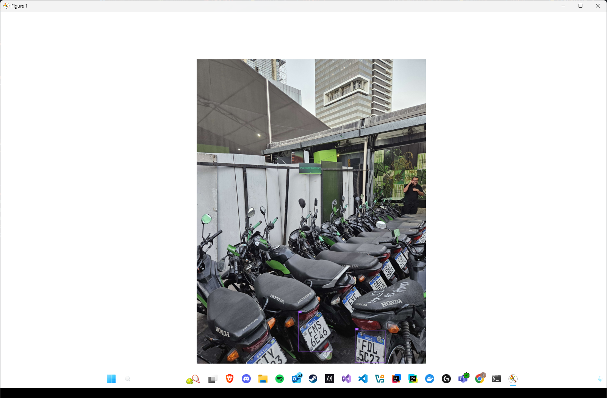

# Projeto Challenge: DISRUPTIVE ARCHITECTURES: IOT, IOB & GENERATIVE IA

## Autores
- 👤 Samuel Yariwake - RM5556461 
- 👤 Luiz Felipe - RM5555591
- 👤 Gabriel Lemos - RM554819

Após uma visita presencial a um dos principais galpões operados pela Mottu, o grupo SLL identificou que a adoção isolada de IoT ou Visão Computacional não seria suficiente para atender às necessidades do projeto. Ficou claro que a combinação dessas duas tecnologias seria essencial para criar uma solução robusta, capaz de lidar com a complexidade e a dinâmica do ambiente logístico observado.
<div align="center">

|  |  |
|:-------------------:|:--------------------:|
| **Exemplo 1**       | **Exemplo 2**        |

|  |  |
|:---------------------:|:--------------------:|
| **Exemplo 3**         | **Exemplo 4**        |

As fotos acima foram registradas por um dos integrantes durante a visita ao galpão. A ausência de processos logísticos claros e a organização baseada apenas na memória dos funcionários dificultaram a adoção imediata de visão computacional: o conceito de "moto" variava de veículos novos a sucata, tornando o cenário altamente despadronizado. Percebemos que seria necessário um dataset robusto e específico, o que nos levou a considerar o IoT como alternativa mais viável.

Durante a pesquisa, exploramos três principais hipóteses de solução para localização e controle:

- **Integração com API de geolocalização:** Inicialmente cogitamos conectar alguma API, como o Google Maps, para obter a localização exata via satélite. No entanto, percebemos que essa abordagem não atenderia plenamente às necessidades do projeto.

- **Triangulação em tempo real:** Avaliamos a possibilidade de rastreamento por triangulação de sinais, mas identificamos desafios técnicos e de infraestrutura para implementação no galpão. Seria necessário um planejamento detalhado para definir os pontos de referência (anchors) em cada cenário, e, conforme demonstrado neste [vídeo](https://www.youtube.com/watch?v=-GNkobAxao0), o processo mostrou-se bastante complexo para nossa aplicação, a pesquisa teria que ser MUITO extensa.

- **Módulo GPS dedicado:** Optamos por integrar um módulo GPS ao sistema, permitindo a localização precisa dos veículos de forma autônoma, sem depender de infraestrutura externa. Essa abordagem se destacou como a mais viável e custo-efetiva, conforme observado nestes vídeos de referência:
    - [Como usar módulo GPS com Arduino](https://www.youtube.com/watch?v=VNDbhSJFhC4&t=24s)
    - [Tutorial de GPS para projetos embarcados](https://www.youtube.com/watch?v=09sNLmoJ3HI&t=105s)

    Além disso, a pesquisa de preços mostrou que módulos como o [GY-NEO6MV2](https://www.robocore.net/sensor-robo/modulo-gps-gy-neo6mv2-com-antena?gad_campaignid=16517456855) e opções similares no [AliExpress](https://pt.aliexpress.com/item/1005008730055127.html) são acessíveis, reforçando a escolha pelo excelente custo-benefício.

O arquivo [`gps.ino`](gps.ino), disponível neste repositório, apresenta uma simulação da integração do módulo GPS ao sistema. Ele coleta e processa coordenadas geográficas em tempo real, permitindo a localização precisa e autônoma dos veículos. O código exemplifica a leitura dos dados do GPS e sua integração ao fluxo do projeto, reforçando a viabilidade da solução para rastreamento e controle logístico.

Além disso, utilizamos valores fictícios para simular a identificação de qual galpão (X ou Y) e ala (Z ou B) a moto está localizada, por meio de estruturas condicionais simples (`if`/`else`). Essa abordagem facilita a expansão do código (apesar de reconhecermos de que isso não será o cenário de produção, é só uma v0), permitindo que ele evolua conforme novas funcionalidades forem implementadas nas diferentes unidades.

Após concluir a pesquisa, partimos para a etapa de simulação. No entanto, identificamos que seria inviável simular o módulo GPS externo de forma realista: o computador local não consegue replicar o funcionamento desse hardware, e a plataforma Wokwi não oferece suporte completo para esse tipo de simulação. Por isso, optamos por adquirir um módulo GPS físico para testes práticos, mas ele não chegou a tempo do prazo da sprint 1. Diante disso, desenvolvemos uma solução alternativa para garantir um MVP funcional e cumprir o entregável da sprint.

Inicialmente, avaliamos a utilização de modelos prontos e datasets amplos do Roboflow para implementar uma camada de visão computacional como redundância ao IoT — ou seja, um "guard rail" caso o sistema principal falhasse. No entanto, durante os testes com o script [`anpr-vv2b2.py`](anpr-vv2b2.py), percebemos que esses modelos genéricos apresentavam baixa precisão, especialmente para placas brasileiras.





Diante desse desafio, optamos por utilizar apenas o modelo pré-treinado YOLOv12 para detecção de placas veiculares, sem recorrer a datasets adicionais ou realizar treinamento extra nesta etapa. Para a próxima sprint, planejamos criar um dataset personalizado e aprofundar o uso do YOLOv12, visando resultados mais precisos e adaptados ao nosso cenário. Na pasta `runs`, temos o resultado em imagens!

Se baseamos nesse vídeo: https://www.youtube.com/shorts/ocA30qI9Z-M

Mesmo sem otimizações específicas, o **YOLOv12** já demonstrou desempenho superior em comparação com os modelos padrão do Roboflow. Embora ambos tenham sido treinados para diferentes escopos de detecção, observamos que, mesmo em testes com modelos prontos para verificação de motocicletas, o desempenho do Roboflow foi inconsistente, variando de ruim a nulo.

---

### Nossa Visão para o Futuro da Visão Computacional na Logística

Propomos transformar a gestão logística por meio da visão computacional, buscando um controle mais preciso e automatizado das motocicletas. O fluxo de trabalho planejado inclui:

1. **Identificação e Contagem:**  
    Câmeras com a aplicação do nosso futuro modelo treinado com YOLO identificarão e contarão automaticamente o número de motocicletas presentes em cada área.

2. **Verificação de Placas:**  
    O sistema verificará a existência de placas em cada motocicleta detectada.

3. **Reconhecimento de Placas:**  
    Quando possível, a tecnologia avançará para o reconhecimento do número da placa, permitindo validar a localização da motocicleta dentro do sistema.

4. **Sinalização de Pendências:**  
    Motocicletas detectadas de traseira e sem placa serão automaticamente sinalizadas como _pendentes de regularização_, garantindo que nenhuma exceção passe despercebida.

---

Esse fluxo de trabalho integrado proporcionará maior controle, eficiência e confiabilidade na gestão logística, representando um avanço significativo na automação dos processos.

## Tecnologias Utilizadas

- **OpenCV**: Biblioteca fundamental para leitura, processamento e manipulação de imagens.
- **NumPy**: Utilizada para operações matemáticas e manipulação eficiente de arrays, facilitando o tratamento de dados de imagem.
- **Supervision**: Responsável pela anotação visual das detecções, desenhando caixas delimitadoras e rótulos sobre as imagens processadas.
- **Roboflow**: Plataforma de treinamento, hospedagem e inferência de modelos de IA, empregada para detecção de placas veiculares em imagens.
- **Ultralytics**: Framework utilizado para implementação e treinamento do modelo YOLO, especializado em detecção de objetos com alta performance.

### Bibliotecas do Arduino

```cpp
#include "TinyGPS++.h"
#include "SoftwareSerial.h"
```

Essas tecnologias e bibliotecas foram integradas para viabilizar o processamento de imagens, a detecção automática de placas e a apresentação dos resultados de forma clara e visual, além de permitir a comunicação eficiente com o hardware embarcado.